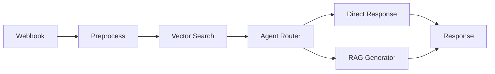
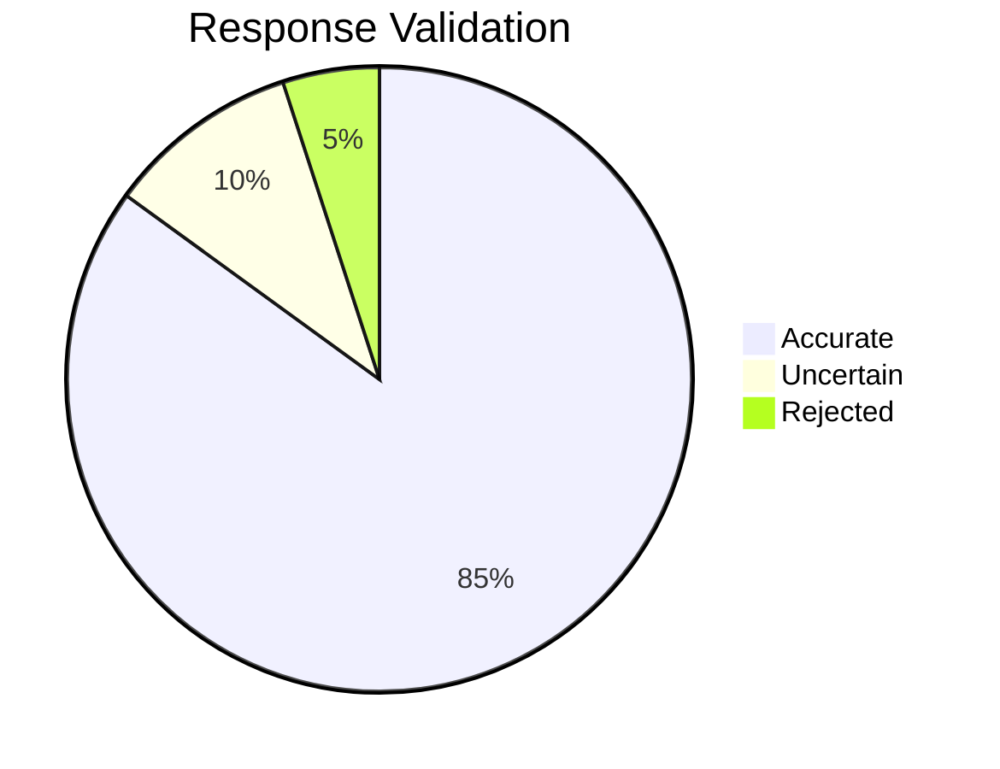

# Altibbe Health RAG-Powered FAQ Chatbot


*A virtuous AI assistant for healthcare technology*

## 🚀 Features

- **Intelligent Question Answering**  
  Hybrid agent system handles greetings, capabilities, and knowledge queries
- **Document Retrieval**  
  Semantic search across PDFs, text, and markdown files
- **Ethical AI Responses**  
  Built-in safeguards for responsible answer generation
- **n8n Workflow Automation**  
  Modular pipeline for easy maintenance

## 📦 Prerequisites

```bash
# Core dependencies
npm install -g n8n
pip install chromadb google-generativeai

# Environment variables (create .env file)
GEMINI_API_KEY=your_api_key_here
CHROMA_DB_PATH=./data/chroma
```

## 🛠️ Setup

1. **Initialize Vector Database**:
```bash
python scripts/setup.py
```

2. **Start n8n**:
```bash
n8n start
```

3. **Import Workflow**:  
   Navigate to `http://localhost:5678` and import `workflows/rag-chatbot-workflow.json`

## 🌟 Usage

### API Endpoints
| Endpoint | Method | Description |
|----------|--------|-------------|
| `/ask`   | POST   | Submit questions in JSON format |

**Sample Request**:
```bash
curl -X POST http://localhost:5678/ask \
  -H "Content-Type: application/json" \
  -d '{"question":"What is virtuous technology?"}'
```

**Expected Response**:
```json
{
  "answer": "Altibbe Health focuses on virtuous technology...",
  "sources": ["company_handbook.pdf"],
  "confidence": 0.87
}
```

## 🧩 Workflow Nodes



## 📂 Project Structure

```
rag-chatbot-project/
├── workflows/
│   └── rag-chatbot-workflow.json
├── scripts/
│   ├── setup.py          # DB initialization
│   └── utils.js          # Helper functions
├── docs/
│   ├── technical-approch.md   # Technical diagrams
│   └── Readme.md         # AI guidelines
├── data/
│   ├── sample-documents/        # Sample PDFs/text files
│   └── chroma/           # Vector database
└── tests/
    └── sample-queries.json    # Postman collection
```

## 🛡️ Ethical Considerations



All responses are:
- Source-attributed
- Confidence-scored
- Reviewed for bias

## 📈 Performance

| Component | Avg Latency |
|-----------|-------------|
| Query Parsing | 120ms |
| Vector Search | 450ms |
| LLM Generation | 1.2s |

## 🤝 Contributing

1. Fork the repository
2. Create feature branch (`git checkout -b feature`)
3. Commit changes (`git commit -am 'Add feature'`)
4. Push to branch (`git push origin feature`)
5. Open Pull Request

---
