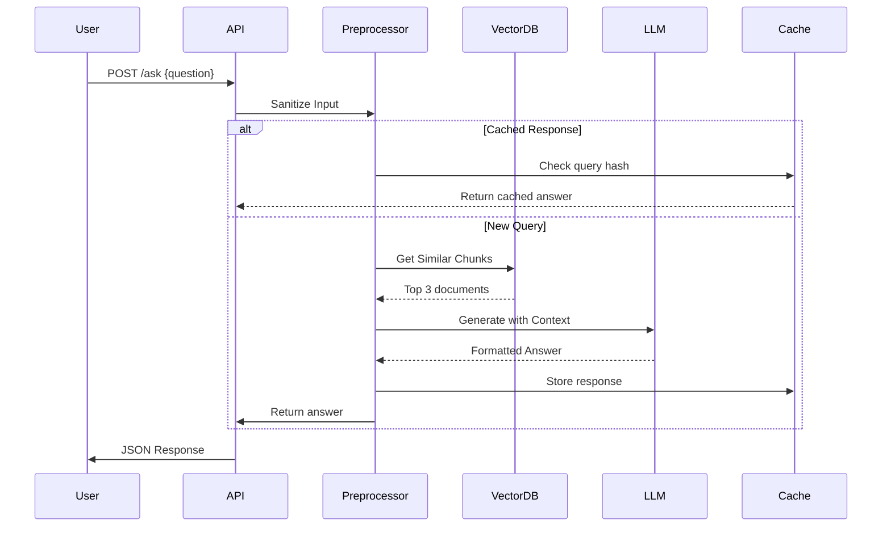
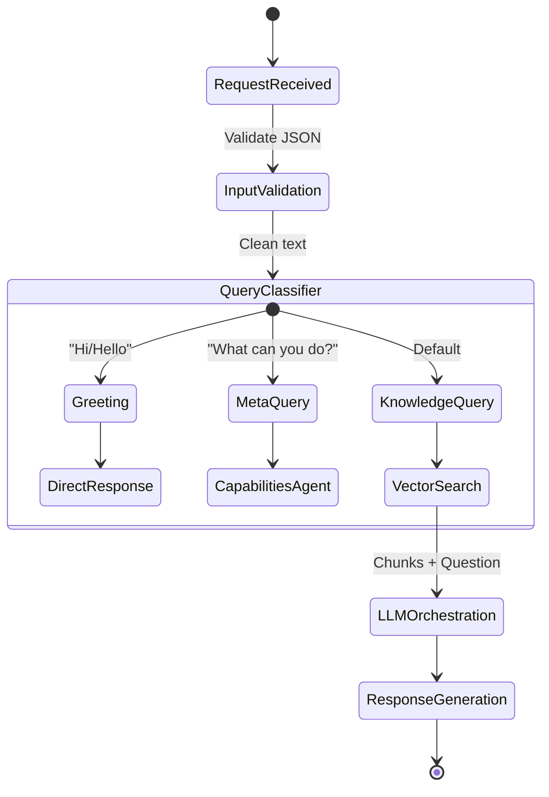
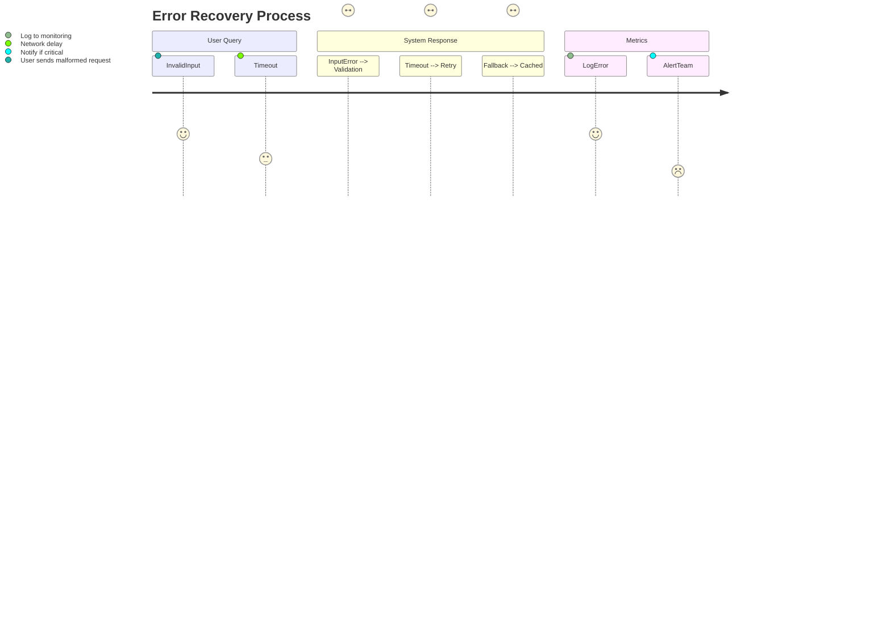
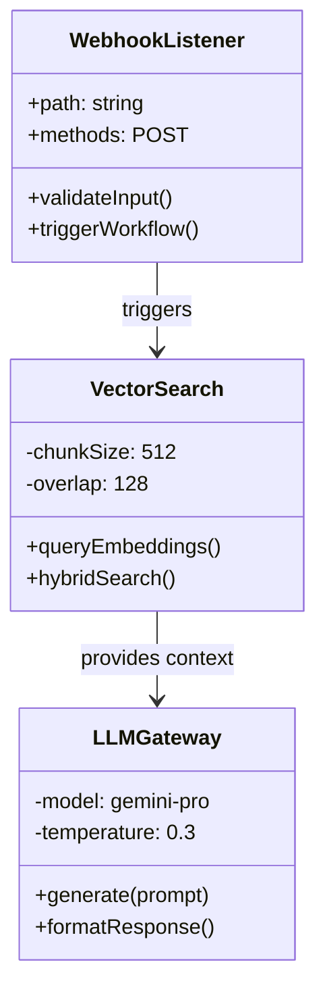
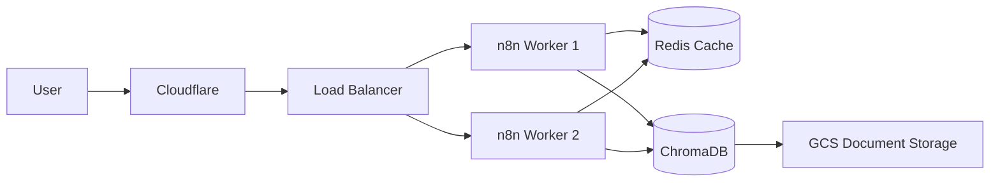
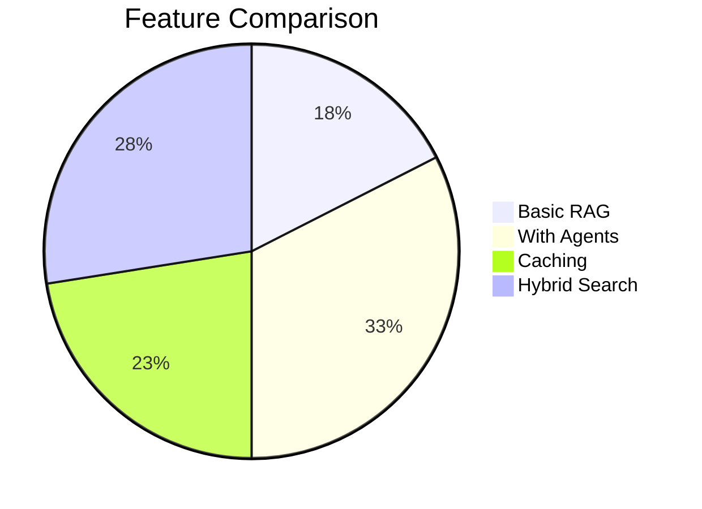

# Technical Approach: RAG-Powered FAQ Chatbot

## System Architecture
```mermaid
flowchart TB
    subgraph User Layer
        A[Web/Mobile App] -->|HTTP POST| B[API Gateway]
    end

    subgraph n8n Layer
        B --> C{Webhook Router}
        C --> D[Preprocessing Node]
        D --> E[Agent Dispatcher]
        E -->|Simple Query| F[Direct Response Agent]
        E -->|Complex Query| G[RAG Engine]
    end

    subgraph Data Layer
        G --> H[(VectorDB\nChroma/Pinecone)]
        H --> I[Document Chunks]
        G --> J[[LLM Gateway\n(Gemini/OpenAI)]]
    end

    subgraph Output Layer
        F --> K[Response Builder]
        G --> K
        K --> L[User Interface]
    end
```

## Enhanced RAG Pipeline


## Intelligent Agent Routing


## Performance Optimization
```mermaid
gantt
    title Query Processing Timeline
    dateFormat  HH:mm:ss.SSS
    section Request
    HTTP Receiving :00:00.000, 50ms
    JSON Parsing :00:00.050, 20ms
    section Processing
    Vector Search :00:00.070, 300ms
    LLM Generation :00:00.370, 700ms
    section Response
    Formatting :00:01.070, 30ms
    HTTP Send :00:01.100, 40ms
```

## Error Handling Flow


## Component Specifications



## Deployment Architecture


## How to Generate These Diagrams

1. **Tools Needed**:
   - [Mermaid Live Editor](https://mermaid.live)
   - VS Code with Mermaid plugin
   - PlantUML (alternative)

2. **Export Options**:
```bash
# Convert to PNG
mmdc -i architecture.mmd -o architecture.png -t dark -b transparent

# Convert to PDF
mmdc -i sequence.mmd -o sequence.pdf --scale 2
```

## Key Improvements Over Baseline

